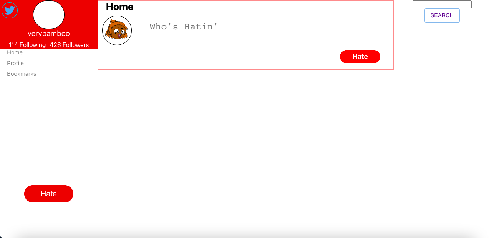

# Hater

https://haterip.netlify.app/

## About

The evil twins of Twitter, the users are welcome to descend into haters to release your inner hatred from the abyss of your heart on this platform.

### Terminologies

- followers --> haters
- following --> hating
- users --> haters
- tweets --> hates
- comments --> criticisms
- likes --> dislikes
- retweets --> rehates

### Technologies/Tools

- SQL
- Django
- CSS
- JavaScript
- Python
- HTML
- Sass
- GitHub
- Netlify
- Axios
- Postman
- Visual Studio Code

## Design

### Main Page

### Sign Up Page

### Home Page

### Criticisms

## Documentations

1. Front-end and back-end folders were created.
2. Merged the front-end and back-end folders.
3. first commit to branch.
4. Twittdeer app and project working directories were created.
5. Branch name were changed.
6. Empty.jsx file and .gitignore file were added.
7. Temp file were removed.
8. Several issues were fixed and then committed.
9. Several directories were restructured.
10. Front-end react app were created and later merged.
11. .gitignore file were added in twittdeerBackEnd.
12. Minor changes on back-end file and later merged into main branch.
13. Adding the database and seed sql files.
14. Removing user lines in db.sql file.
15. Name changed from Twittdeer to Hater.
16. Profile page working on process.
17. Models were created.
18. Environment variable file was created and later edited.
19. Changing the file that has Twittdeer into Hater.
20. Home component and homepage component were edited.
21. Seed.sql file updated.
22. Img css selector were removed to prevent future error.
23. Redundant files removed.
24. Some files and old folder were removed.
25. Refactoring the split screens and error page.
26. App.js were updated.
27. Additional texts were added into requirements.txt in back-end file.
28. Landing were changed.
29. Redirected to front-end/public were added.
30. Adding basic models, routes and serializers into the haters.
31. Minor edit on the homepage.
32. Back-end updated.
33. Revision pushed for profile component.
34. Twittdeer back-end directory deleted.
35. Seed.sql updated.
36. All hates were pushed.
37. Query, home query and big query were all fixed.
38. Model component created.
39. Profile screen created.
40. Cors error and migrations issue were resolved.
41. Working on the MVP begins.
42. Bugs fixed.
43. Text box issues fixed.
44. Profile component finished.
45. Media query to sign up page were added.
46. Modal component completed.
47. Props were placed in the profile.
48. Comment route done with url params.
49. Fixed some styling.
50. Cors whitelist updated.
51. More routes were added.
52. MVP routes done.
53. Date and time were added to hates.
54. Date and time were formatted to d: h: m:
55. The functionaly basic search bar were added to the home page.
56. Password validator added.
57. Search bar updated.
58. Cors added.
59. New authentication token was issued.
60. SMS were added.
    
61. Adding criticisms pop up component.
62. Changing time format.
63. SearchBar connect to profile page with specific userProfile ID were made.
64. Working on some buttons and reset the submit button.
65. Delete migration.
66. Merging issues fixed.
67. Some small bugs fixed.
68. Landing polished.
69. Inverted logo switched out.
70. Text centered.
71. Input cleaned up & button border removed.
72. Issue with update button fixed.
73. Hover color adjusted.
74. Buttons fixed.
75. Added time and date fixed.
76. Migration removed.
77. Modal fixed.
78. Timezone on backend changed and format fixed.
79. Bugs fixed.
80. Comment section added.
81. Landing fixed.
82. Profile page fixed.
83. Landing.jsx updated.
84. Links changed.

# Curse Sorcerers

- Evan
- Chris
  
- Mustafa
  
- David
  
- Lawrence
  
- George
  
- Jeffrey
  
- Joseph
  
- Laura
  
- Arthur
  
- Leon
  
